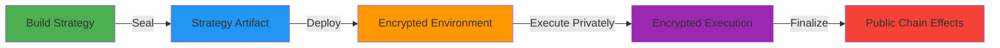

<div align="left">

# Siphon Protocol

> **The Fully Encrypted Execution Layer for DeFi**
> 
> Run any DeFi logic privately. Execute strategies without revealing intent. Build with privacy as the default.

[](https://nextjs.org/)
[](https://www.typescriptlang.org/)
[](https://cronos.org/)
[](https://ethereum.org/)
[](LICENSE)

[🚀 Live Demo](https://siphon.money) | [📚 Documentation](/docs) | [🐦 Twitter](https://x.com/SiphonMoney)

</div>

---

## 🌟 Our Vision

A world where DeFi trading is truly private — where your strategies, positions, and execution remain invisible to front-runners, MEV bots, and surveillance. Where traders can execute large orders without moving markets, and where **privacy becomes the default state of decentralized finance**.

---

## 🎯 What is Siphon Protocol?

Siphon Protocol is a **private execution system** where sealed strategy artifacts are executed in controlled, encrypted environments and only finalized effects touch public chains.

We make cryptographic privacy as accessible and composable as modern trading infrastructure, creating the global platform where:

- **Private strategies** are built, sealed, and executed
- **Strategy artifacts** run in encrypted environments
- **Only finalized effects** are published to public chains
- **Full trading applications** can be built without revealing execution logic

### What Siphon is NOT

❌ **Not a DEX** - We're not building another decentralized exchange  
❌ **Not a smart contract with strategies** - We're not embedding strategies in on-chain contracts  
❌ **Not a single privacy primitive** - We're a unified execution platform

### What Siphon IS

✅ **A private execution system** - Sealed strategy artifacts execute in controlled, encrypted environments  
✅ **Encrypted strategy execution** - Your strategy logic stays sealed, only effects are visible  
✅ **Multi-chain execution layer** - Execute privately across multiple chains  
✅ **Builder platform** - Build, deploy, and execute strategies with privacy as default

---

## 🚀 Key Features

### Build and Deploy
Create custom DeFi strategies with our visual flow editor. Chain swaps, deposits, withdrawals, and custom logic into complex workflows. Deploy instantly. Execute privately. Share with the community or keep your strategies sealed.

### On-Demand Strategy Execution
Run any DeFi strategy on-demand in a fully encrypted manner. Arbitrage, yield farming, liquidity mining, grid trading—all privately. Connect your wallet, select a strategy, execute. No long setups. No complicated configuration.

### Fully Encrypted Execution
Every strategy execution runs through fully encrypted channels. Your orders execute privately. Your strategy logic stays sealed. Execute your alphas without revealing your intent. Only the finalized effects touch public chains.

### Multi-Chain & Multi-Protocol
An ecosystem of chains and protocols:
- **Chains**: Cronos (CRO), Ethereum, Base, Bitcoin, Polygon, Arbitrum
- **Protocols**: Uniswap, 1inch, Curve, Jupiter, Raydium, Orca

### Open Strategy Marketplace with x402 Payment
Strategies are accessible to everyone through our **x402 payment standard**. Any machine, application, or user can:
- **Call strategies** on-demand via standardized payment interfaces
- **Combine strategies** to create complex execution workflows
- **Integrate strategies** into their own builders and applications
- **Pay for execution** using the x402 payment mechanism, enabling seamless strategy composability across the ecosystem

---

## 🏗️ Our Approach

We're building Siphon Protocol in **three layers**:

### 1. The Private Execution Layer
A unified registry where traders browse, publish, fork, and deploy:
- **Sealed strategies** for protected logic
- **Encrypted order types** for hidden intent
- **Private execution environments** for strategy artifacts
- **x402 payment integration** enabling any machine to call, combine, and execute strategies

### 2. The Builder Layer
A full-stack development environment with:
- **Code mode**: Familiar languages for developers
- **Flow mode**: Visual graph editor for non-coders
- Modern trading ergonomics with privacy composition
- **Build, seal, and deploy** strategies with one click
- **Open integration**: Use strategies in your own builders and applications via x402

### 3. The Runtime & Deployment Layer
One-click deployment across:
- Cloud, edge, local, enclave, and chain environments
- APIs, sandboxes, and encrypted pipelines
- Private execution, encrypted evaluation, sealed artifact execution
- **Only finalized effects** are published to public chains

---

## 🔐 Privacy Technologies

Our platform leverages cutting-edge cryptographic privacy:

- **Fully Homomorphic Encryption** - Compute on encrypted data
- **Multi-Party Computation** - Secure collaborative computation
- **Zero-Knowledge Audit Proofs** - Verify without revealing
- **Sealed Strategy Artifacts** - Execute in encrypted environments

---

## 💡 Why This Matters

**For Traders:**
- 🔒 **Privacy**: Execute strategies without revealing logic or intent
- 💰 **No MEV**: Strategy execution invisible to bots and sandwich attacks
- 📊 **Control**: Your strategy logic stays sealed, only effects are public
- ⚡ **Multi-Chain**: Execute privately across multiple chains

**For Developers:**
- 🛠️ **Accessible**: Build privacy-first strategies without cryptographic expertise
- 🧩 **Composable**: Chain privacy primitives together seamlessly
- 🚀 **Deployable**: One-click deployment of sealed strategy artifacts
- 📚 **Standard Library**: Reusable patterns for private DeFi execution
- 🔌 **x402 Integration**: Call, combine, and use strategies in your own applications
- 🌐 **Open Access**: Any machine can execute strategies via standardized payment interfaces

**For the Ecosystem:**
- 🌐 **Unified Platform**: Bridge between research and practice
- 🔓 **Open Source**: Full code available for audit and learning
- 🌟 **Proof of Concept**: Shows what's possible with private execution
- 🤝 **Community-Driven**: Open, extensible platform for everyone

---

## 🎓 How It Works

### Sealed Strategy Execution



**Your strategy logic** stays sealed in encrypted environments. **Only finalized effects** touch public chains. **Nobody** can see your execution logic or intermediate steps.

### Private Execution Flow

1. **Build**: Create your strategy using code or visual flow editor
2. **Seal**: Strategy is encrypted into a sealed artifact
3. **Deploy**: Artifact is deployed to an encrypted execution environment
4. **Execute**: Strategy runs privately, invisible to the public
5. **Finalize**: Only the final effects (swaps, transfers, etc.) are published to public chains

---

## 📈 Roadmap

### Phase 1: Foundation ✅
- ✅ Strategy builder foundation
- ✅ Visual flow editor
- ✅ Multi-chain support foundation
- ✅ Encrypted execution environments

### Phase 2: Strategy Execution 🚧
- ✅ On-demand strategy execution
- ✅ Sealed artifact deployment
- ✅ Private execution runtime
- [ ] Strategy marketplace
- [ ] Advanced strategy types

### Phase 3: Advanced Features 🔮
- [ ] Multi-protocol aggregation
- [ ] Cross-chain execution
- [ ] Portfolio analytics
- [ ] Strategy sharing and forking

### Phase 4: Scale 🌐
- [ ] Enterprise APIs
- [ ] Developer SDK
- [ ] White-label solutions
- [ ] Community governance

---

## 🚀 Getting Started

### Prerequisites

- Node.js 18+ 
- npm or yarn
- Cronos/EVM compatible wallet (for CRO testnet)

### Installation

```bash
# Clone the repository
git clone https://github.com/SiphonMoney/Siphon_Money.git
cd Siphon_Money

# Install dependencies
npm install

# Run development server
npm run dev
```

Visit `http://localhost:3000` to see the application.

### Environment Setup

Create a `.env.local` file:

```env
NEXT_PUBLIC_NETWORK=croTestnet
NEXT_PUBLIC_RPC_URL=https://evm-t3.cronos.org
NEXT_PUBLIC_CHAIN_ID=338
```

### Strategy Payment with x402

Strategies on Siphon Protocol use the **x402 payment standard** for execution fees. This enables:
- **Universal access**: Any machine or application can call strategies
- **Composability**: Combine multiple strategies into complex workflows
- **Integration**: Use strategies in your own builders and applications
- **Standardized payments**: Seamless fee handling across the ecosystem

---

## 📚 Documentation

For detailed documentation, visit our [Documentation Page](/docs) which covers:

- **Our Vision**: The future of private DeFi execution
- **The Manifesto**: Our mission and approach
- **Background**: Why privacy in DeFi matters
- **Looking Forward**: The path ahead
- **Our Approach**: Three-layer architecture
- **The Platform**: Open and extensible design

---

## 🤝 Contributing

We're building Siphon Protocol as an **open, extensible platform** that others can build upon. We're committed to making privacy execution accessible, not proprietary.

We're fostering a community of researchers, developers, and traders who believe that unified privacy execution can become a universal good.

If this resonates with you, we invite you to help shape the future of private execution.

---

## ⚠️ Disclaimer

This is an **experimental platform** built for advancing private DeFi execution.

- ⚠️ **NOT audited** for production use
- ⚠️ **NOT financial advice**
- ⚠️ **USE AT YOUR OWN RISK**

Always test on devnet first. Never invest more than you can afford to lose.

---

## 📞 Community

- **Twitter**: [@SiphonMoney](https://x.com/SiphonMoney)
- **Documentation**: [/docs](/docs)
- **Live Demo**: [siphon.money](https://siphon.money)

---

<p align="center">
  <b>🌟 Siphon Protocol</b>
</p>

<p align="center">
  <i>"The fully encrypted execution layer for DeFi"</i>
</p>

<p align="center">
  <i>Made with ❤️ for the future of private DeFi</i>
</p>
